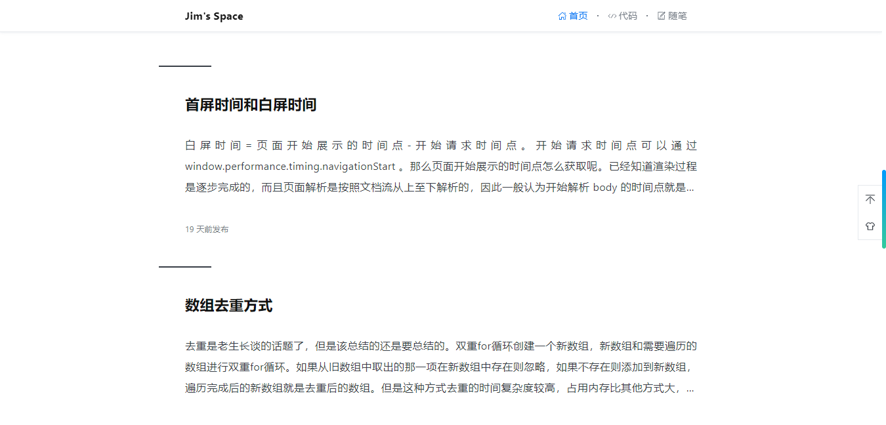
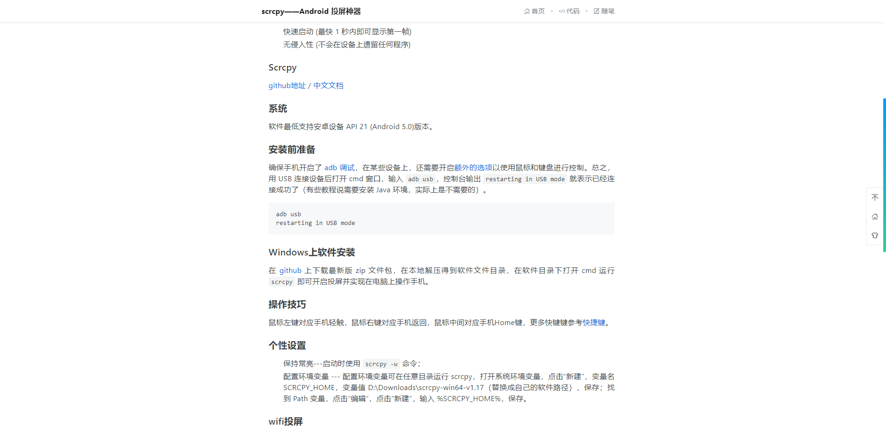

# BLOG_NEXTJS

## 项目介绍

利用 react 服务端框架 [Nextjs](https://nextjs.org/) 写的博客，喜欢请给个 Star 支持一下。

线上地址：[https://imlinhe.com](https://imlinhe.com)

## 项目架构

这是项目的前端部分，还有`管理系统`和`后端服务提供`。

主要技术栈包括：

- Nextjs
- React
- AntDesign
- Linux
- Nginx
- MySql
- Express
- PM2
- Sequelize
- ...

## 安装

1. 运行此项目请 clone 本项目的 github 地址，并修改 utils/fetch 下的 baseUrl 为 `'https://imlinhe.com'`

```
// 访问线上接口
// export const baseUrl = 'https://imlinhe.com'

export const baseUrl = process.env.HOST
```

2. 安装依赖，运行

```
yarn

yarn dev
```

3. 部署

```
yarn build
// 需要全局安装pm2
yarn pm2
```

4. 访问 `localhost:10001`

## 网站截图

> UI 参考 [https://biji.io](https://biji.io/) 搭建。





## 源码剖析

1. 由 [Nextjs](https://nextjs.org) 脚手架 `create-next-app` 搭建；

2. 服务入口文件 --- `ecosystem.config.js`，这是 PM2 的配置文件（[了解更多](https://pm2.keymetrics.io/docs/usage/application-declaration/)），PM2 启动的脚本文件 --- `server.js`，这是 Nextjs 的服务文件（[自定义服务器](https://nextjs.org/docs/advanced-features/custom-server)）。

3. 关于 Nextjs 增量再生和 fallback 功能可以看[src/pages/posts/pid.js](./src/pages/posts/[pid].js)，它们配合使用能极大的优化项目：

```
import React, {useEffect} from 'react'
import PropTypes from 'prop-types'
import {getList, getDetailById, getHitokoto} from '../../api'
import styles from './index.module.scss'
import ErrorBoundary from '../../components/ErrorBoundary' // 错误边界
import hljs from 'highlight.js'
import Layout from '../../components/Layout'
import Loading from '../../components/Loading'
import {useRouter} from 'next/router'

const Posts = ({posts, hitokoto}) => {
  const router = useRouter()
  // 设置 fallback: true 必须进行路由判断，否则打包是无法访问到属性会报错

  useEffect(()=>{
    document.querySelectorAll("pre code").forEach(block => {
      try{
        hljs.highlightBlock(block)
      }
      catch(e){
        console.log(e)
      }
    })
  })

  function createMarkup() {
    return {
      __html: posts.html
    }
  }

  return (
    <Layout hitokoto={hitokoto} title={posts.title} digest={posts.digest}>
      {
        router.isFallback ? 
        <Loading /> : 
        <div className={styles.Detail}>
          <h2 className={styles.title}>{posts.title}</h2>
          {
            posts.html && 
            <ErrorBoundary>
              <article className={[`${styles.markdownBody}`, 'markdown-body'].join(' ')} dangerouslySetInnerHTML={createMarkup()}></article>
            </ErrorBoundary>
          }
        </div>
      }
      
    </Layout>
  )
}

export default Posts

export async function getStaticProps(context) {
  const {pid} = context.params

  const posts = await getDetailById(pid)
  const hitokoto = await getHitokoto()
  return {
    props: { posts, hitokoto },
    revalidate: 1 // 增量再生
  }
}

export async function getStaticPaths() {
  const {list} = await getList({
    pageSize: 999,
    pageNum: 1
  })

  const paths = list.map(item => ({
    params: {pid: `${item.id}`}
  }))

  return {
    paths,
    fallback: true
  }
}

Posts.propTypes = {
  posts: PropTypes.object.isRequired,
  hitokoto: PropTypes.object.isRequired
}

```

4. 入口文件 `src/pages/index.js`，其中含路由重定向。

```
// 根目录
import React, {useEffect} from 'react'
import Layout from '../components/Layout'
import {useRouter} from 'next/router'

export default function Index() {
  const router = useRouter()
  
  useEffect(() => {
    router.prefetch('/home') // 预取
    if (router.pathname === '/') {
      router.replace('/home')
    }
  }, [])

  return (
    <Layout></Layout>
  )
}
```

5. 全局文件引入 `src/pages/_app.js`，其中含插件、全局样式和全局进度条等。

```
import React, {useEffect} from 'react'
import PropTypes from 'prop-types'
import 'dayjs/locale/zh-cn'
// 全局样式
import '../styles/variable.css'
import '../styles/global.css'
import '../styles/common.css'
// import 'highlight.js/scss/github.scss'
import 'github-markdown-css'
// import '../styles/github-markdown.css'
import NProgress from 'nprogress'
import 'nprogress/nprogress.css'
import {useRouter} from 'next/router'

function MyApp({ Component, pageProps }) {
  const router = useRouter()

  useEffect(() => {
    router.events.on('routeChangeStart', () => {
      NProgress.start()
    })
    router.events.on('routeChangeComplete', () => NProgress.done())
    router.events.on('routeChangeError', () => NProgress.done())
  }, [])

  return <Component {...pageProps} />
}

export default MyApp

MyApp.propTypes = {
  Component: PropTypes.elementType.isRequired,
  pageProps: PropTypes.object
}
```


------------------ **教程结束，以下为开发者计划和备忘** --------------------

## TODO

- [x] ESLint
- [x] Vercel
- [x] title修改、description 修改
- [x] 添加博客、分页设置
- [ ] redux
- [ ] 缓存问题
- [ ] 记录部署过程
- [ ] 前端接口不进行验证（其他验证）
- [ ] 查询服务器状态、日志整理

## 服务器部署

git push 到 git 服务器，在 Linux 上 git pull，执行 `npm run build`，再执行 `npm run pm2`.

## QA

1. 起初 .env.production 中的环境变量我设置了 `HOSTNAME=imlinhe.com HOST=https://$HOSTNAME`，在本地打包没什么问题，但是到服务端打包却总是报错，接口调用连接的是 `https://vm-0-6-centos/api/blog/list`，其中 `vm-0-6-centos` 是我服务器的主机名。排查了很久，在服务端执行 `export` 才发现 Linux 有环境变量 HOSTNAME，是 Linux 的环境变量覆盖了我的设置，因此在项目中修改 HOSTNAME 这个关键字就 ok 了。

2. 服务端执行 `yarn build` （有时会）报错 FetchError: invalid json response body at https://v1.hitokoto.cn/ reason: Unexpected end of JSON input ，~~需要删除 pm2 服务 --- `pm2 delete blog-nextjs` 再执行 `yarn build`，然后启动 `yarn pm2`~~，导致错误的原因是 hitokoto 接口返回，目前的解决方案是返回普通文本，然后包装成对象。

3. 添加文章出现在列表中，而访问出现 404 的问题，通过设置 fallback: true 解决，但是设置后打包报错，需要通过路由 router.isFallback 判断显示loading。

